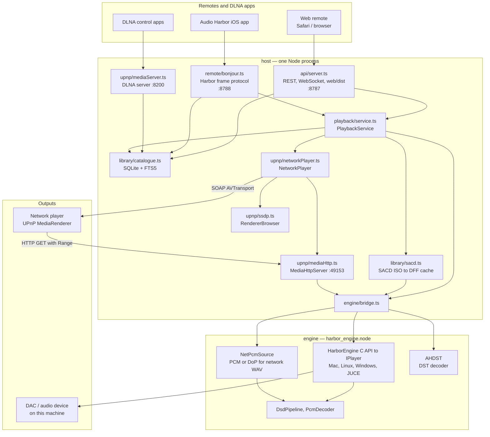
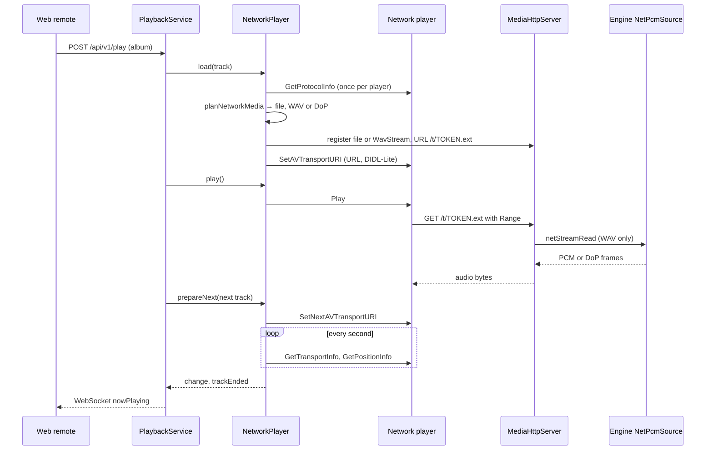

# Audio Harbor Headless — Architecture

Audio Harbor Headless is a music player without a screen. One Node.js process on a Mac, a Linux box (a Raspberry Pi) or Windows plays to a DAC on that machine or to UPnP / DLNA network players. A phone drives it: the web remote in Safari, or the Audio Harbor iOS app over Bonjour. It can also share the library as a DLNA music server.

The sound rules come from [Audio Harbor](https://github.com/petergerov/audio-harbor/blob/main/docs/ARCHITECTURE.md): bit-perfect where the output allows it, no silent resampling, and a badge that says which path the audio takes.

## Stack

| Layer | Tech | Lives in |
|---|---|---|
| Audio engine | C++17 Node-API addon `harbor_engine.node`: native Core Audio / ALSA / WASAPI plus JUCE, picked at runtime (`output.backend`) | `engine/` |
| Host | TypeScript (ES modules) on Node ≥ 22.5: Fastify, `node:sqlite`, music-metadata, bonjour-service, @iarna/toml | `host/` |
| Web remote | Vite + TypeScript, no framework | `web/` |
| Build & release | npm workspaces, cmake-js (JUCE via CMake FetchContent), GitHub Actions | root, `.github/` |

## Big picture



`PlaybackService` is the hub. It owns the queue and routes every command to the local engine or to the `NetworkPlayer`, by the picked output: a device UID, or `upnp:<UDN>` for a network player.

## Repository layout

```
engine/            C++ addon (harbor_engine.node)
  napi/binding.cpp   N-API surface: transport, devices, DST, network streams
  src/HarborEngine.* C API facade; owns the one IPlayer
  src/PlayerFactory  picks the backend (auto → native)
  src/MacPlayer, LinuxPlayer, WinPlayer, JucePlayer, StubPlayer
  src/DsdPipeline.*  DSF / DFF parsing, DoP packing, DSD→PCM FIR, chunked readers
  src/PcmDecoder.*   WAV / FLAC / MP3 (dr_libs), ALAC / AAC via ffmpeg (Linux, Windows)
  src/NetPcmSource.* random-access PCM or DoP for network players
  src/AHDSTDecoder.* MPEG-4 DST decoder (SACD)
  third_party/       dr_flac, dr_mp3, dr_wav
host/src/
  index.ts           composition root and CLI: serve | pair | rescan
  api/server.ts      Fastify REST + WebSocket + web remote files
  playback/service.ts  PlaybackService: queue, output routing, gapless
  library/           Catalogue (SQLite), SACD ISO parsing and extraction
  upnp/              network players (control point, media HTTP, planner) and the DLNA server
  remote/            Bonjour remote for the iOS app, mDNS responder, wire DTOs
  engine/bridge.ts   typed wrapper around the addon; engine events
  config.ts, paths.ts, pairing.ts, power.ts, net.ts, types.ts
web/src/             web remote (see web/README.md)
docs/                product page, this document
config.example.toml  default config, copied on first start
create-package.sh, install.sh, start.sh   packaging, setup on a device, launcher
```

## Runtime

One process: `node host/dist/index.js serve` (or `./start.sh`). At start it loads the config, scans the library roots (only changed files), starts searching for network players, applies the stored output, opens the API, claims `audioharbor.local`, and starts the optional DLNA server and the Bonjour remote.

### Ports and discovery

| Port | What | Config |
|---|---|---|
| 8787 TCP | REST API, WebSocket `/api/v1/ws`, the web remote's files | `server.port` |
| 8788 TCP | Bonjour remote for the iOS app (`_audioharbor._tcp`) | `remote.bonjour_port`, `remote.bonjour_enabled` |
| 49153 TCP | Audio for network players (`/t/…`, `/a/…`); any free port when taken | `network.media_port` |
| 8200 TCP | DLNA MediaServer, only with sharing on | `sharing.port`, `sharing.enabled` |
| 1900 UDP | SSDP: finds renderers (M-SEARCH every 30 s, NOTIFY alive / byebye), announces the DLNA server | — |
| 5353 UDP | mDNS: `audioharbor.local` (`-2`, `-3` … when taken), `_http._tcp`, `_audioharbor._tcp`; IPv4 only | `server.local_hostname` |

### Data on disk

All state is under `~/.audio-harbor-headless/`. The music folders are only read.

| File | What | Written by |
|---|---|---|
| `config.toml` | settings; copied from `config.example.toml` on first start, rewritten when a setting changes | `config.ts` |
| `catalogue.sqlite` | tracks, labels, playlists, FTS5 search index (WAL) | `library/catalogue.ts` |
| `artwork/<hash>.jpg` | embedded cover art, by content hash | catalogue scan |
| `pairing.json` | pairing PIN, paired tokens, server id | `pairing.ts` |
| `cache/sacd/*.dff` | SACD tracks extracted as plain DSD (DST decoded) | `library/sacd.ts` |

## Engine

```
binding.cpp (N-API)  →  HarborEngine C API (harbor_engine_*)  →  IPlayer
                                                                  ├─ MacPlayer   Core Audio
                                                                  ├─ LinuxPlayer ALSA
                                                                  ├─ WinPlayer   WASAPI
                                                                  ├─ JucePlayer  JUCE AudioDeviceManager
                                                                  └─ StubPlayer  no audio
binding.cpp (N-API)  →  NetPcmSource, AHDST (no player involved)
```

- **`IPlayer`** (`Player.h`) is the backend contract: devices, output mode, DSD level, load / play / pause / stop / seek, volume, state, events. `HarborEngine.cpp` holds the one player behind a mutex. Switching `output.backend` recreates it and applies device, mode and DSD level again.
- **Backend choice** (`PlayerFactory.cpp`): `auto` and `native` take the OS's own stack, `juce` takes JUCE. Builds ship both (`HARBOR_WITH_JUCE`, default on).
- **Output modes** per backend:

  | Mode | Mac (Core Audio) | Linux (ALSA) | Windows (WASAPI) | JUCE |
  |---|---|---|---|---|
  | Shared | HAL output on the picked device or the system default | the picked device, or `default` (PipeWire / Pulse) | shared mix format | device graph |
  | Exclusive | hog mode on an external DAC, rate follows the file | a `hw:` / `plughw:` device | exclusive | ASIO / exclusive device types |
  | DoP | DoP on an external DAC | DoP on a `hw:` device | DoP over exclusive | DSD→PCM, badged |

  When the device cannot do the mode, the player falls back and says so in `conversion_badge` (e.g. `Shared (pick hw: device for Exclusive/DoP)`).
- **Local decoding**: `load` decodes the whole file into memory. MacPlayer reads PCM with ExtAudioFile, JucePlayer with JUCE's format readers, LinuxPlayer and WinPlayer with dr_libs (WAV / FLAC / MP3) and ffmpeg for ALAC / AAC. DSD (`loadDsdFile`) is packed as DoP or converted to ~88.2 kHz PCM with `dsd_pcm_level` (0 / +3 / +6 dB). MacPlayer converts on a worker thread and starts playing once the first PCM is ready.
- **DSD→PCM**: multi-stage linear-phase FIR (`DsdPipeline.cpp`), DSD rate / 32, / 64 or / 128 → 88.2 kHz, one more 2:1 stage for 44.1 kHz (Wi‑Fi).
- **Network streams** (`NetPcmSource`): random access by frame, so the host can answer any `Range` request. Sources: `DsdSource` (DSD→PCM through `DsdPcmReader`), `DopSource` (DoP at DSD rate / 16), FLAC, WAV, MP3, AIFF, ExtAudioFile on macOS, and a decode-to-memory fallback. `DsdByteReader` reads DSF / DFF in 64 KiB chunks per channel for both DSD sources. `DsdPcmReader` pre-rolls after a jump, so a seek gives the same samples as playing through.
- **DST**: the host feeds DST frames from an SACD ISO through `dstBegin` / `dstDecodeFrame` / `dstEnd` and writes plain DSD into the DFF cache.
- **Threads and events**: players run their own audio threads and report `state` and `ended` through an N-API ThreadSafeFunction; `bridge.ts` re-emits them as `engineEvents`. Network stream open and read run as AsyncWorkers, so a renderer's read never blocks the event loop. `load` itself runs on the calling thread.

## Host

`index.ts` wires everything; nothing else constructs services. `PlaybackService` gets the catalogue, config access, the renderer browser and the network player through its constructor.

| Module | Job |
|---|---|
| `api/server.ts` | Fastify: REST under `/api/v1`, WebSocket `/api/v1/ws` (pushes `nowPlaying` and `queue`), the web remote from `web/dist`. Every API route except health and pairing needs a token (`Authorization: Bearer` or `?token=`). |
| `playback/service.ts` | Queue (album, artist, folder, playlist or label), repeat, transport, output pick. Routes to the engine or the `NetworkPlayer`. Moving between this host and a network player, or changing what DSD becomes on one, reloads the current track at the same position. Emits `nowPlaying` and `queue`. |
| `library/catalogue.ts` | SQLite catalogue: `tracks`, `labels`, `playlists`, `tracks_fts`. A scan walks the roots, skips unchanged files by mtime, reads tags with music-metadata and stores cover art by hash. A track's identity is its absolute path; an SACD track is `disc.iso#sacd/N`. Playlists and labels are sets of paths. |
| `library/sacd.ts` | Scarlet Book: reads the TOC into catalogue tracks; extracts a track to an uncompressed DFF on first play (DST decoded by the engine), asynchronously with yields, one extraction per file; prefetches the next tracks. |
| `upnp/*` (network players) | SSDP discovery, SOAP control, media HTTP, the media planner and `NetworkPlayer` — see below. |
| `upnp/mediaServer.ts` | DLNA MediaServer: device description, ContentDirectory Browse (albums, artists, folders), files under the library roots by `Range`, SSDP announcements. |
| `remote/bonjour.ts` | The Audio Harbor iOS app's protocol: `[u32 length][kind][payload]` frames, JSON envelopes v2 (hello / pair, subscribe, transport, playSelection, browse, search, trackOptions, editTrack) and binary artwork. `wire.ts` maps snapshots to its DTOs. |
| `remote/mdns.ts` | One mDNS responder (bonjour-service): probes and claims `audioharbor.local`, publishes `_http._tcp` and `_audioharbor._tcp`, answers AAAA with NSEC (IPv4 only), follows address changes, says goodbye on exit. |
| `pairing.ts` | Six-digit PIN → random token (`POST /api/v1/pair` or the Bonjour hello). The PIN changes after each pairing. Web and iOS share the tokens. |
| `config.ts` | Loads `config.toml`, normalizes every value, writes it back on change. |
| `power.ts` | `KeepAwake`: `caffeinate` (macOS) or `systemd-inhibit` (Linux) while a network player streams. |

### Network players

A network player is an output like a DAC: the host is the control point and serves the audio; the player pulls it over HTTP. Same design as Audio Harbor's [UPNP.md](https://github.com/petergerov/audio-harbor/blob/main/docs/UPNP.md).

| Part | Where | Job |
|---|---|---|
| Discovery | `ssdp.ts` `RendererBrowser` | M-SEARCH every 30 s per interface, NOTIFY alive / byebye, `max-age` expiry, device description; keeps renderers with AVTransport. Output UID `upnp:<UDN>`. |
| Control | `controlPoint.ts`, `httpClient.ts`, `xml.ts` | SOAP: AVTransport (SetAVTransportURI, SetNextAVTransportURI, Play, Pause, Stop, Seek, GetTransportInfo, GetPositionInfo), RenderingControl volume, ConnectionManager GetProtocolInfo. |
| What is sent | `networkMedia.ts` `planNetworkMedia` | The file untouched when the player lists its type, else WAV. DSD by the player's mode (`network.dsd_modes`): Auto sends the DSF / DFF untouched when the player lists DSD, else PCM; PCM = 88.2 kHz / 24-bit; DoP = 24-bit WAV at DSD rate / 16. `network_stream = "wifi"` makes DSD 44.1 kHz / 16-bit PCM in every mode. |
| Serving | `mediaHttp.ts` `MediaHttpServer`, `networkMedia.ts` `WavStream` | Opaque tokens `/t/<n>-<hex>.<ext>` and `/a/` for artwork; `Range`, `HEAD`, DLNA headers. WAV is made on the fly with a computed `Content-Length`, so a `Range` maps to a frame and seeking works. The URL host is this machine's address toward the player. |
| Session | `networkPlayer.ts` `NetworkPlayer` | Load, play, pause (Stop as fallback), seek, volume (coalesced). Polls position every second, tells a track's end from a stop on the device, follows the player leaving and coming back. Arms the next track with SetNextAVTransportURI for gapless (remembered per player when refused). While DSD goes out as DoP the volume is left alone. |



## Web remote

A single-page app served by the host, mobile first, desktop layout on wide screens. Layers depend inward only — `ui` → `services` → `state` / `api` → `core` — and nothing below `ui` touches the DOM. `main.ts` is the composition root; views get an `AppContext` of interfaces; state is one `Store<AppState>`; live player state follows the `PlayerMarkup` contract, so lists keep their scroll position while tracks change. The rules and the folder map are in [web/README.md](../web/README.md).

The web remote talks only to the REST API and the WebSocket. Pairing stores the token in `localStorage` (`harbor.token`).

## Flows

**Play an album on a local DAC.** The web remote posts `/api/v1/play` with the album id. `PlaybackService` queues the album's tracks, resolves an SACD track to its cached DFF, and calls `engineLoad` and `enginePlay`. The engine's `state` and `ended` events come back through `engineEvents`. On `ended` the service loads the next track, and every change goes out over the WebSocket as `nowPlaying` / `queue`.

**Play to a network player.** As in the sequence above. A failed or lost player puts the session into `failed` with a message; once the player is back, Play loads the track again where it was.

**Change the output.** `PUT /api/v1/output` stores device, mode, backend, network stream and the player's DSD mode in `config.toml`. Moving between this host and a network player — or, on the same player, changing what DSD becomes — reloads the current track at the same position, playing if it was.

**Pair.** The host prints the PIN at start (`harbor pair` shows it again, `--rotate` makes a new one). The web remote posts it to `/api/v1/pair`; the iOS app sends it in its hello. Both get a token for all later requests.

## Build, run, release

| Command | Does |
|---|---|
| `npm run build:engine` | `engine/scripts/build.js` → cmake-js (or plain CMake): `engine/build/Release/harbor_engine.node`. JUCE is fetched by CMake; `HARBOR_WITH_JUCE=0` builds native-only. |
| `npm run build:web` | Vite → `web/dist` (served by the host; restart the host after a rebuild) |
| `npm run build:host` | `tsc` → `host/dist` |
| `npm run serve` | build all, then `harbor serve` |
| `npm run package:prebuilt` | build, prune dev dependencies, `create-package.sh --prebuilt` → `dist/packages/audio-harbor-headless-<version>-<platform>.tar.gz` with Node 22 under `runtime/` |

- **Release** (`.github/workflows/release-packages.yml`): started by hand with a tag. Builds darwin-arm64, darwin-x64, linux-x64, linux-arm64 and win32-x64 packages and attaches them to a GitHub Release. The version comes from `package.json`.
- **On a device**: `install.sh` installs build dependencies and builds from source (Raspberry Pi / Linux); `start.sh` picks the bundled Node, checks the addon's ABI, clears the macOS quarantine flag, creates the config on first start and runs `serve`, `pair` or `rescan`.

## Testing

There is no automated test suite yet. Changes are checked by hand:

- **Network players**: the renderer simulator in Audio Harbor (`tools/upnp`, `upnp-renderer-sim --silent`, optional `--sink-file`, `--no-next`, `--max-rate`). Run the host with a scratch `HOME`, so `~/.audio-harbor-headless` stays untouched.
- **Engine streams**: small Node scripts that open `netStreamOpen` / `netStreamRead` and compare jumps against continuous reads, or DoP bytes against the file.
- **Web remote**: in a browser at phone and desktop widths.

## Known gaps

- Shuffle is stored and reported, but the play order does not use it yet.
- A rescan adds and updates tracks but never removes them: files deleted from disk, or under a removed source, stay in the catalogue.
- Local `load` decodes the whole file into memory on the calling thread; long DSD files cost memory and block the event loop while they load (MacPlayer's DSD→PCM conversion runs on a worker).
- DST is decoded only from SACD ISOs. A DST-compressed `.dff` file does not play locally or as PCM / DoP; it reaches a network player only untouched (DSD Auto, Full stream, the player lists DFF).
- The DLNA server is minimal: browse and serve files as they are, no transcoding, no search.

## Where to change what

| To … | Change |
|---|---|
| add an API route | `host/src/api/server.ts`, its client in `web/src/api/*Api.ts`, types in both `types.ts` |
| add a config key | `HarborConfig` in `host/src/types.ts`, load / save in `config.ts`, `config.example.toml`, README |
| support a format on network players | `PASSTHROUGH` / planner in `host/src/upnp/networkMedia.ts`; a decoder in `engine/src/NetPcmSource.cpp` when it must become WAV |
| add an output backend | an `IPlayer` in `engine/src/`, `PlayerFactory.cpp`, `CMakeLists.txt` |
| add a web tab or settings pane | the view plus one entry in `web/src/ui/views/registry.ts` or `PANES` in `settingsView.ts` |
| speak a new iOS remote command | `host/src/remote/bonjour.ts` (and `wire.ts` for DTOs) |
