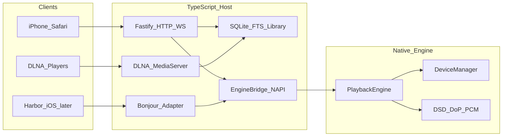

# Audio Harbor Headless — Implementation Plan

## Ziel

Ein **GUI-loser Media-Host** auf Mac und Linux: Ordner mounten, Output wählen, Library browsen, abspielen — alles vom iPhone. Zusätzlich als **DLNA Music Server**. Konzept wie [`../audio-harbor`](../audio-harbor), ohne SwiftUI-Shell.

### Produktentscheidungen

| ID | Entscheidung |
|---|---|
| **1C** | Steuerung: **Web-Remote zuerst** (Safari auf dem iPhone); später Bonjour-Kompatibilität mit der Audio-Harbor-iOS-App |
| **2B** | Qualität: **Audiophile Parität** — Exclusive / DoP / DSD, bit-perfect wo möglich |
| **Stack** | **C++ Audio-Engine** (Core Audio / ALSA, optional JUCE) + **TypeScript/Node Host** + **Vite Web-UI** — kein Go, kein Rust als Produktstack |

Harbor-Swift bleibt Referenz für Regeln und Remote-Protokoll, nicht Runtime auf Linux.

---

## Architektur



### Schichten

| Schicht | Technologie | Aufgabe |
|---|---|---|
| Audio | C++ / N-API (`harbor_engine.node`) | Devices, Shared / Exclusive / DoP, DSD→PCM, Decode |
| Host | TypeScript / Node (Fastify) | Config, Library, API, Pairing, DLNA, Bonjour, Queue |
| UI | Vite + TypeScript | Mobile Web-Remote (iOS-ähnliche Oberfläche) |

### Engine-Kopplung (C-API)

Ein Prozess. Die native Library wird über Node-API geladen:

- `listDevices` / `setDevice` / `setOutputMode` / `setDsdPcmLevel`
- `load` / `play` / `pause` / `seek` / `stop` / `setVolume`
- `getState` / `version`
- Events: `state`, `ended`, `deviceChange`

Domain-Typen (`Track`, `OutputMode`, Snapshots) leben in TypeScript; die Engine kennt Dateipfade, PCM/DSD-Buffers und Device-UIDs.

---

## Repo-Struktur

```
audio-harbor-headless/
  package.json                 # npm workspaces
  config.example.toml
  README.md
  implementation_plan.md
  host/                        # TypeScript daemon
    src/
      index.ts                 # CLI: serve | pair | rescan
      config.ts
      paths.ts
      pairing.ts
      types.ts
      api/server.ts            # Fastify REST + WebSocket
      library/catalogue.ts     # Scan, metadata, SQLite FTS
      playback/service.ts      # Queue, transport, routing
      engine/bridge.ts         # N-API wrapper
      upnp/                    # MediaServer + Renderer CP
      remote/bonjour.ts        # Protocol v2
  engine/                      # C++ + CMake + cmake-js
    CMakeLists.txt
    napi/binding.cpp
    src/
      HarborEngine.h/.cpp      # C ABI
      Player.h
      MacPlayer.cpp            # Core Audio Exclusive/DoP
      LinuxPlayer.cpp          # ALSA Exclusive/DoP
      DsdPipeline.cpp          # DSF load, DoP pack, DSD→PCM
      StubPlayer.cpp           # Fallback
      JucePlayer.cpp           # optional (HARBOR_WITH_JUCE=1)
  web/                         # Vite mobile remote → host serves dist/
    src/main.ts
    src/styles.css
    src/api.ts
    src/icons.ts
```

Config: `~/.audio-harbor-headless/config.toml` (aus `config.example.toml`).  
CLI: `harbor serve` · `harbor pair` · `harbor rescan`.

---

## TypeScript-Host

- **Runtime:** Node 20+ (getestet mit Node 26); Fastify REST + WebSocket
- **DB:** `node:sqlite` + FTS5 (Catalogue)
- **Metadata:** `music-metadata`
- **DLNA/SSDP:** eigenes Modul (ContentDirectory + HTTP Range)
- **Bonjour:** `bonjour-service`; Frame-Protokoll analog Harbor Remote v2 (`_audioharbor._tcp`)
- **Web:** statische Files aus `web/dist`; Pairing-PIN + QR in der Konsole

### REST (Auszug)

`/api/v1/{health,pair,now-playing,queue,mounts,browse,search,play,transport,output,devices,sharing,artwork,ws}`

---

## Native Audio-Engine

### macOS (`MacPlayer`)

- **Shared:** HAL Output Unit, ExtAudioFile Decode (PCM)
- **Exclusive:** Device hog + Nominal Sample Rate = Track; nur externe Interfaces (USB/TB/FW/PCI)
- **DoP:** DSD → High-Rate-PCM mit Markern; sonst DSD→PCM
- Hardware-Volume wo möglich; Conversion-Badge an den Host

### Linux (`LinuxPlayer`)

- **Shared:** ALSA `default` (PipeWire/Pulse)
- **Exclusive / DoP:** ALSA `hw:` / `plughw:`
- WAV + DSF Pfade; PCM-Formate erweitert über Engine später

### DSD-Pipeline

- DSF / DFF laden
- DoP-Packing
- DSD→PCM Multi-Stage Kaiser/sinc Decimation (~88.2 kHz), Gain 0 / +3 / +6 dB

### Optional JUCE

```bash
HARBOR_WITH_JUCE=1 npm run build:engine
```

JUCE-Lizenz vor Distribution/Verkauf klären.

---

## Web-Remote (iPhone)

Zielgefühl: native iOS-App.

- System-Font, Light/Dark (`prefers-color-scheme`)
- Tab Bar: Library · Playing · Folders · Output
- Large Titles, Segmented Control, Search
- Grouped inset lists
- Now Playing (Artwork, Scrubber, Transport, Volume)
- Mini Player über der Tab Bar
- Pairing als Sheet mit 6-digit PIN
- Safe Areas (Notch / Home Indicator)

---

## Umsetzungsreihenfolge & Status

| # | Schritt | Status |
|---|---|---|
| 1 | Scaffold — npm workspace, Fastify, C++ N-API, Config, CLI | done |
| 2 | Library — Roots, Scan, SQLite+FTS, Browse/Search API | done |
| 3 | Shared Playback — Engine + Queue/Transport/WebSocket | done |
| 4 | Web UI — Mounts, Browse, Play, Output, Now Playing (iOS-UI) | done |
| 5 | Mac Exclusive + DoP + DSD-Pipeline + Badges | done |
| 6 | Linux Exclusive/hw + DoP/PCM-Fallback | done (Basis) |
| 7 | DLNA Music Server — Sharing an/aus | done |
| 8 | UPnP Renderer als Output | done (Discovery + SetNext) |
| 9 | Bonjour Remote v2 für Harbor-iOS | done (artwork + trackOptions/edit) |

---

## Bewusst raus (v1)

- SwiftUI / AU-Plugin-Rack / StoreKit
- Streaming-Services (Qobuz, Tidal, …)
- iPhone als lokaler Player („Listen on iPhone“)
- Rust- oder Go-Host
- App-Sandbox-Bookmarks (Daemon: Host-Rechte + Config-Pfade)

---

## Erfolgskriterien

- Mac: bit-perfect FLAC → externer DAC (Exclusive, Rate-Match)
- Mac: DSF via DoP oder sauberer PCM-Fallback
- Linux: Playback + Output-Wahl; Exclusive wo `hw:` verfügbar
- iPhone Safari: Folder → Browse → Play unter 60 s
- DLNA-Client sieht dieselbe Library
- Harbor-iOS kann per Bonjour denselben Host steuern (Protokoll v2)

---

## Build & Run

```bash
npm install
npm run build:engine
npm run build:web
npm run build:host
npm run harbor -- serve
```

LAN-URL + QR + Pairing-PIN erscheinen in der Konsole.  
Config: `~/.audio-harbor-headless/config.toml` — DLNA via `sharing.enabled = true`.

---

## Offene Folgearbeiten

### Erledigt (Fortsetzung)

- UPnP/DIDL/SSDP nutzen LAN-IP (`URLBase`, media URLs, M-SEARCH replies)
- Web: Live-Scrub + Positions-Clock, PWA Manifest + Apple Touch Icon
- Linux: FLAC / MP3 / WAV / AIFF via `dr_libs` (`PcmDecoder`)
- DFF-Laden + DSD→PCM Kaiser/sinc Multi-Stage (näher Harbor-FIR)
- Artists-Browse im DLNA ContentDirectory
- UPnP `SetNextAVTransportURI` für Gapless-Vorbereitung
- Bonjour: Artwork-Frames + `trackOptions` / `editTrack`
- Web: Artwork-Blob-Cache + `navigator.vibrate` Haptics
- SACD ISO: Stereo-TOC Listing + uncompressed Extract → cached DFF
- SACD/DFF DST: AHDSTDecoder vendored + extract → cached DFF
- ALAC/AAC: Mac via ExtAudioFile; Linux via ffmpeg/ffprobe Fallback
- UPnP DIDL: bitrate / sampleFrequency / bitsPerSample / nrAudioChannels + DLNA flags
- Web: Service Worker offline shell (`sw.js`)

### Noch offen

1. Harbor-FIR Feintuning (flat to 25 kHz, ≥ 120 dB Stopband-Messung)
2. Native ALAC ohne ffmpeg auf Linux (JUCE / libalac)
3. DFF-embedded DST Chunks (nicht nur SACD ISO)
4. Renderer-HTTP: korrekte MIME aus Catalogue-Track statt nur Dateiendung
