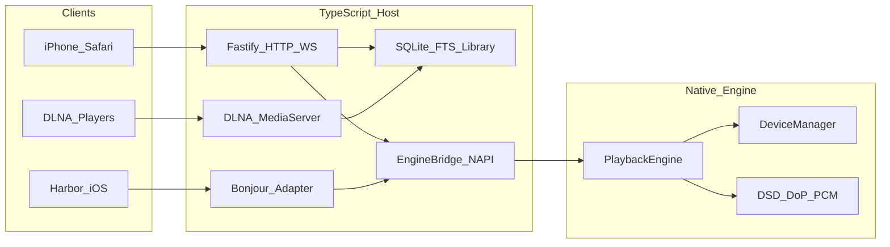

# Audio Harbor Headless — Implementation Plan

## Ziel

Ein **GUI-loser Media-Host** auf Mac, Linux und Windows: Ordner mounten, Output wählen, Library browsen, abspielen — alles vom iPhone. Zusätzlich als **DLNA Music Server**. Konzept wie [`../audio-harbor`](../audio-harbor), ohne SwiftUI-Shell.

### Produktentscheidungen

| ID | Entscheidung |
|---|---|
| **1C** | Steuerung: **Web-Remote zuerst** (Safari auf dem iPhone), dazu Bonjour-Kompatibilität mit der Audio-Harbor-iOS-App |
| **2B** | Qualität: **Audiophile Parität** — Exclusive / DoP / DSD, bit-perfect wo möglich |
| **Stack** | **C++ Audio-Engine** (native Core Audio / ALSA / WASAPI) + **TypeScript/Node Host** + **Vite Web-UI** |

Harbor-Swift bleibt Referenz für Regeln und Remote-Protokoll, nicht Runtime auf Linux.

---

## Architektur


```mermaid
flowchart LR
  subgraph clients [Clients]
    Safari[iPhone_Safari]
    HarborIOS[Harbor_iOS]
    DLNAClient[DLNA_Players]
  end
  subgraph host [TypeScript_Host]
    API[Fastify_HTTP_WS]
    Lib[SQLite_FTS_Library]
    Share[DLNA_MediaServer]
    Bonjour[Bonjour_Adapter]
    Bridge[EngineBridge_NAPI]
  end
  subgraph engine [Native_Engine]
    Play[PlaybackEngine]
    Dev[DeviceManager]
    DSD[DSD_DoP_PCM]
  end
  Safari --> API
  HarborIOS --> Bonjour
  DLNAClient --> Share
  API --> Lib
  API --> Bridge
  Bonjour --> Bridge
  Share --> Lib
  Bridge --> Play
  Play --> Dev
  Play --> DSD
```

### Schichten

| Schicht | Technologie | Aufgabe |
|---|---|---|
| Audio | C++ / N-API (`harbor_engine.node`) | Devices, Shared / Exclusive / DoP, DSD→PCM, Decode |
| Host | TypeScript / Node (Fastify) | Config, Library, API, Pairing, DLNA, Bonjour, Queue |
| UI | Vite + TypeScript | Mobile Web-Remote (iOS-ähnliche Oberfläche) |

### Engine-Kopplung (C-API)

Ein Prozess. Die native Library wird über Node-API geladen:

- `listDevices` / `setDevice` / `setOutputMode` / `setDsdPcmLevel`
- `load` / `play` / `pause` / `seek` / `stop` / `setVolume`
- `getState` (inkl. Stream-Rate, Device-Rate / -Bits, DoP) / `version`
- Network-Streams: `netStreamOpen` / `netStreamRead` (WAV / DoP für Netzwerk-Player), DST: `dstBegin` / `dstDecodeFrame` / `dstEnd`
- Events: `state`, `ended`, `deviceChange`

Domain-Typen (`Track`, `OutputMode`, Snapshots) leben in TypeScript; die Engine kennt Dateipfade, PCM/DSD-Buffers und Device-UIDs.

---

## Repo-Struktur

```
audio-harbor-headless/
  package.json                 # npm workspaces
  config.example.toml
  README.md
  docs/                        # Product homepage + Screenshots, ARCHITECTURE, LINUX, …
  implementation_plan.md
  host/                        # TypeScript daemon
    src/
      index.ts                 # CLI: serve | pair | rescan
      config.ts, paths.ts, pairing.ts, types.ts, power.ts, net.ts
      drives.ts                # USB-Laufwerke + SMB-Shares (Linux-Paket)
      system.ts                # CPU / Speicher / Platten für Settings → About
      update.ts                # Software Update aus der Remote
      resolution.ts            # Rate / Bits im Pfad-Badge
      api/server.ts            # Fastify REST + WebSocket
      library/                 # catalogue.ts (SQLite FTS), sacd.ts, dstDff.ts
      playback/service.ts      # Queue, transport, routing
      engine/bridge.ts         # N-API wrapper
      upnp/                    # MediaServer + Renderer-Control-Point
      remote/                  # bonjour.ts (Protokoll v3), browse, settings, artwork, wire, mdns
  engine/                      # C++ + CMake + cmake-js
    CMakeLists.txt
    napi/binding.cpp
    src/
      HarborEngine.h/.cpp      # C ABI
      Player.h, PlayerFactory.cpp
      MacPlayer.cpp            # Core Audio Exclusive/DoP
      LinuxPlayer.cpp          # ALSA Exclusive/DoP
      WinPlayer.cpp            # WASAPI Exclusive/DoP
      DsdPipeline.cpp          # DSF / DFF, DoP pack, DSD→PCM
      PcmDecoder, FrameSource, PlaybackFeed, AHDSTDecoder
      StubPlayer.cpp           # Fallback
  web/                         # Vite mobile remote → host serves dist/ (siehe web/README.md)
    src/main.ts, app/, core/, api/, state/, services/, ui/
  packaging/                   # linux/ (.deb, systemd, Root-Helper), macos/ (.pkg, Menüleisten-App)
```

Config: `~/.audio-harbor-headless/config.toml` (aus `config.example.toml`).  
CLI: `harbor serve` · `harbor pair` · `harbor rescan`.

---

## TypeScript-Host

- **Runtime:** Node ≥ 22.5 (`node:sqlite`; Releases bringen Node 22 unter `runtime/` mit); Fastify REST + WebSocket
- **DB:** `node:sqlite` + FTS5 (Catalogue)
- **Metadata:** `music-metadata`
- **DLNA/SSDP:** eigenes Modul (ContentDirectory + HTTP Range)
- **Bonjour:** `bonjour-service`; Frame-Protokoll analog Harbor Remote v3 (`_audioharbor._tcp`)
- **Web:** statische Files aus `web/dist`; Pairing-PIN + QR in der Konsole, die PIN auch in der Remote (erstes Gerät, danach Settings → About)

### REST (Auszug)

`/api/v1/{health,pair,now-playing,queue,mounts,folders,drives,library,system,update,remotes/pin,browse,search,settings,play,transport,output,devices,playlists,labels,track-options,sharing,artwork,ws}`

---

## Native Audio-Engine

### macOS (`MacPlayer`)

- **Shared:** HAL Output Unit, ExtAudioFile Decode (PCM)
- **Exclusive:** Device hog + Nominal Sample Rate = Track; nur externe Interfaces (USB/TB/FW/PCI)
- **DoP:** DSD → High-Rate-PCM mit Markern; sonst DSD→PCM
- Hardware-Volume wo möglich; Conversion-Badge an den Host, dazu Nominal-Rate und physisches Format des Geräts

### Linux (`LinuxPlayer`)

- **Shared:** ALSA `default` (PipeWire/Pulse) oder das gewählte Gerät
- **Exclusive / DoP:** ALSA `hw:` / `plughw:`; schreibt das Sample-Format, das das Gerät nimmt
- FLAC / MP3 / WAV / AIFF über `dr_libs`, ALAC / AAC über ffmpeg; Rate / Bits des Geräts aus `hw_params` (hinter `plughw` aus `/proc/asound`)

### Windows (`WinPlayer`)

- **Shared / Exclusive / DoP** über WASAPI

### DSD-Pipeline

- DSF / DFF laden
- DoP-Packing
- DSD→PCM Multi-Stage Kaiser/sinc Decimation (~88.2 kHz), Gain 0 / +3 / +6 dB

### Audio-Backends

```toml
[output]
backend = "auto"   # auto | native → Core Audio / ALSA / WASAPI
```

---

## Web-Remote (iPhone)

Zielgefühl: native iOS-App im Harbor-Look (Chassis / Elfenbein / Amber). Details: [web/README.md](web/README.md).

- Tabs: **Deck · Catalogue · Settings**; Catalogue mit Dirs · Albums · Artists · Lists
- Deck: Turntable- oder Reel-to-Reel-Bühne, Scrubber, Transport, Volume, Pfad-Badge; Up Next als Sheet (Phone) oder rechte Leiste (Desktop)
- Mini Player über der Tab Bar, auf dem Desktop Seitenleiste + Bottom-Bar (nicht auf Deck)
- Settings: Sources (Ordner, Laufwerke, SMB, Rescan), Output, Sharing, About (Host-Status, PIN, Software Update)
- Pairing mit 6-stelliger PIN
- Safe Areas (Notch / Home Indicator)

---

## Umsetzungsreihenfolge & Status

| # | Schritt | Status |
|---|---|---|
| 1 | Scaffold — npm workspace, Fastify, C++ N-API, Config, CLI | done |
| 2 | Library — Roots, Scan, SQLite+FTS, Browse/Search API | done |
| 3 | Shared Playback — Engine + Queue/Transport/WebSocket | done |
| 4 | Web UI — Mounts, Browse, Play, Output, Now Playing (iOS-UI) | done |
| 5 | Mac Exclusive + DoP + DSD-Pipeline + Badges | done |
| 6 | Linux Exclusive/hw + DoP/PCM-Fallback | done (Basis) |
| 7 | DLNA Music Server — Sharing an/aus | done |
| 8 | UPnP Renderer als Output | done (Discovery + SetNext) |
| 9 | Bonjour Remote für Harbor-iOS | done (Protokoll v3, artwork + trackOptions/edit, Settings) |
| 10 | Windows WASAPI, JUCE entfernt — nur native Stacks | done |
| 11 | Pakete: signiertes macOS-`.pkg` + Menüleisten-App, Linux-`.deb` + systemd + Installer | done |
| 12 | Laufwerke + SMB-Shares aus der Remote (Linux-Paket) | done |
| 13 | Software Update aus der Remote (Linux-Paket) | done (ab 1.0.3) |
| 14 | Pfad-Badge mit Rate / Bits — lokaler DAC und Netzwerk-Player | done (1.0.5 / 1.0.6) |

---

## Bewusst raus (v1)

- SwiftUI / AU-Plugin-Rack / StoreKit
- Streaming-Services (Qobuz, Tidal, …)
- iPhone als lokaler Player („Listen on iPhone“)
- Rust- oder Go-Host
- App-Sandbox-Bookmarks (Daemon: Host-Rechte + Config-Pfade)

---

## Erfolgskriterien

- Mac: bit-perfect FLAC → externer DAC (Exclusive, Rate-Match)
- Mac: DSF via DoP oder sauberer PCM-Fallback
- Linux: Playback + Output-Wahl; Exclusive wo `hw:` verfügbar
- iPhone Safari: Folder → Browse → Play unter 60 s
- DLNA-Client sieht dieselbe Library
- Harbor-iOS kann per Bonjour denselben Host steuern (Protokoll v3)

---

## Build & Run

```bash
npm install
npm run build:engine
npm run build:web
npm run build:host
npm run harbor -- serve
```

LAN-URL + QR + Pairing-PIN erscheinen in der Konsole.  
Config: `~/.audio-harbor-headless/config.toml` — DLNA via `sharing.enabled = true`.

---

## Offene Folgearbeiten

### Erledigt (Fortsetzung)

- UPnP/DIDL/SSDP nutzen LAN-IP (`URLBase`, media URLs, M-SEARCH replies)
- Web: Live-Scrub + Positions-Clock, PWA Manifest + Apple Touch Icon
- Linux: FLAC / MP3 / WAV / AIFF via `dr_libs` (`PcmDecoder`)
- DFF-Laden + DSD→PCM Kaiser/sinc Multi-Stage (näher Harbor-FIR)
- Artists-Browse im DLNA ContentDirectory
- UPnP `SetNextAVTransportURI` für Gapless-Vorbereitung
- Bonjour: Artwork-Frames + `trackOptions` / `editTrack`
- Web: Artwork-Blob-Cache + `navigator.vibrate` Haptics
- SACD ISO: Stereo-TOC Listing + uncompressed Extract → cached DFF
- SACD/DFF DST: AHDSTDecoder vendored + extract → cached DFF
- ALAC/AAC: Mac via ExtAudioFile; Linux via ffmpeg/ffprobe Fallback
- UPnP DIDL: bitrate / sampleFrequency / bitsPerSample / nrAudioChannels + DLNA flags
- Web: Service Worker offline shell (`sw.js`)
- DST-komprimierte `.dff` → dekodierter DFF-Cache (`cache/dst-dff`)
- Renderer-HTTP: MIME aus dem Format des Catalogue-Tracks

### Noch offen

1. Harbor-FIR Feintuning (flat to 25 kHz, ≥ 120 dB Stopband-Messung)
2. Native ALAC ohne ffmpeg auf Linux (libalac)
3. Windows: Rate / Bits des Geräts im Pfad-Badge (heute nur der Pfad)
4. Software Update für macOS-`.pkg` und portable Installationen (heute nur Hinweis + Release Notes)
